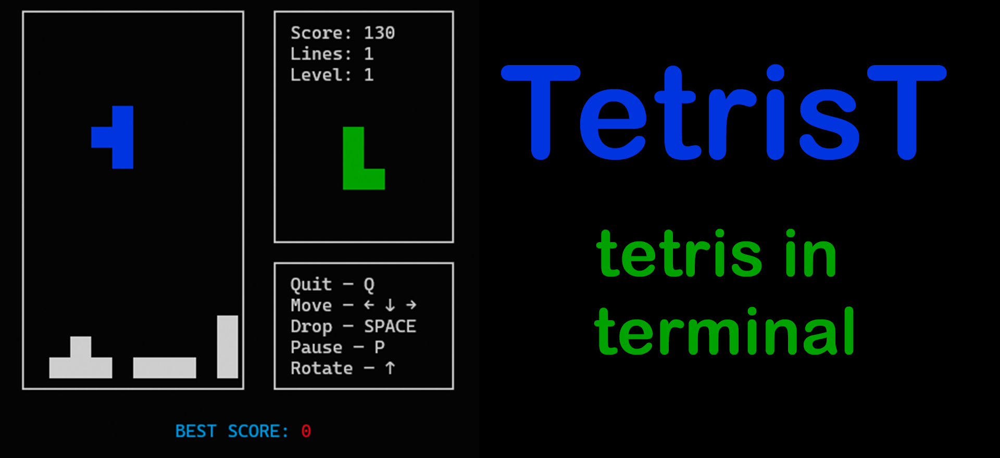

# TetrisT
Tetris in your terminal.
<!--Badges-->



<!-- About the program -->
## About the game

You can play the famous 1980s puzzle game called Tetris.

<!--Installation-->
## Installation (Linux)

1. Cloning the repository

```git clone https://github.com/soglopr/TetrisT.git```

2. Go to the TerWiki directory

```cd TetrisT```

3. Running the script

```python3 main.py```
<!-- Commands -->
## Commands

Quit — ```key Q```

Move — ```keys LEFT, DOWN, RIGHT``` (```A, S, D``` or ```J, K, L```)

Drop — ```key SPACE```

Pause — ```key P``` (```W``` or ```I```)

Rotate — ```key UP```

<!--Dependencies-->
## Dependencies
Python version 3.7 or higher, PIP 22.0.2 or higher.

<!--Source-->
## Source 
The project is a rework of [another work](https://github.com/shkolovy/tetris-terminal.git).
